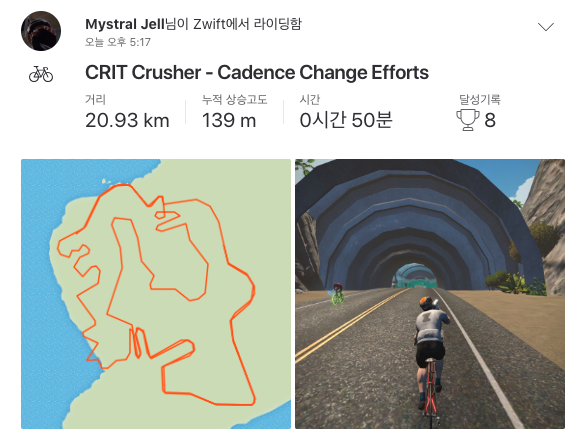

  

Zwift에서 5주 프로그램을 시작해 이제 4주차 둘째 날입니다.  
매주 첫째 날에는 Micro Burst라고 해서 순간적으로 엄청난 힘으로 굴린 다음 잠깐 쉬고 다시 엄청난 힘으로 굴리고..의 반복입니다.  
이게 그 주의 제일 힘든 프로그램인데, 그 다음 날은 조금 쉬어가라는 의미에서 페달만 굴리면 되는 코스입니다.  
그렇다고 해서 마냥 굴리는 게 아닌, 같은 힘으로 빠르게 굴렸다가 천천히 굴렸다가 해서 전날 뭉친 근육을 풀어주는 느낌입니다.
