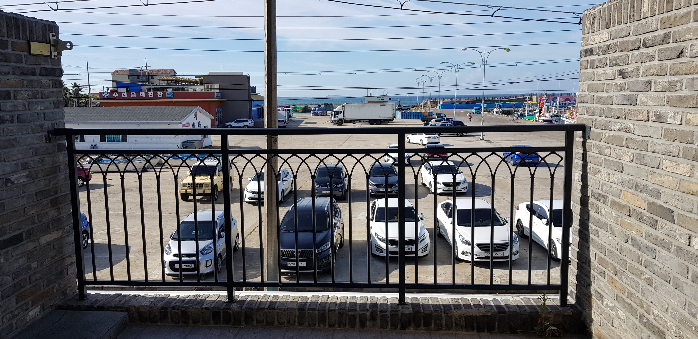
아침이 밝았습니다!  
10시 즈음에 출발한거 같네요!  

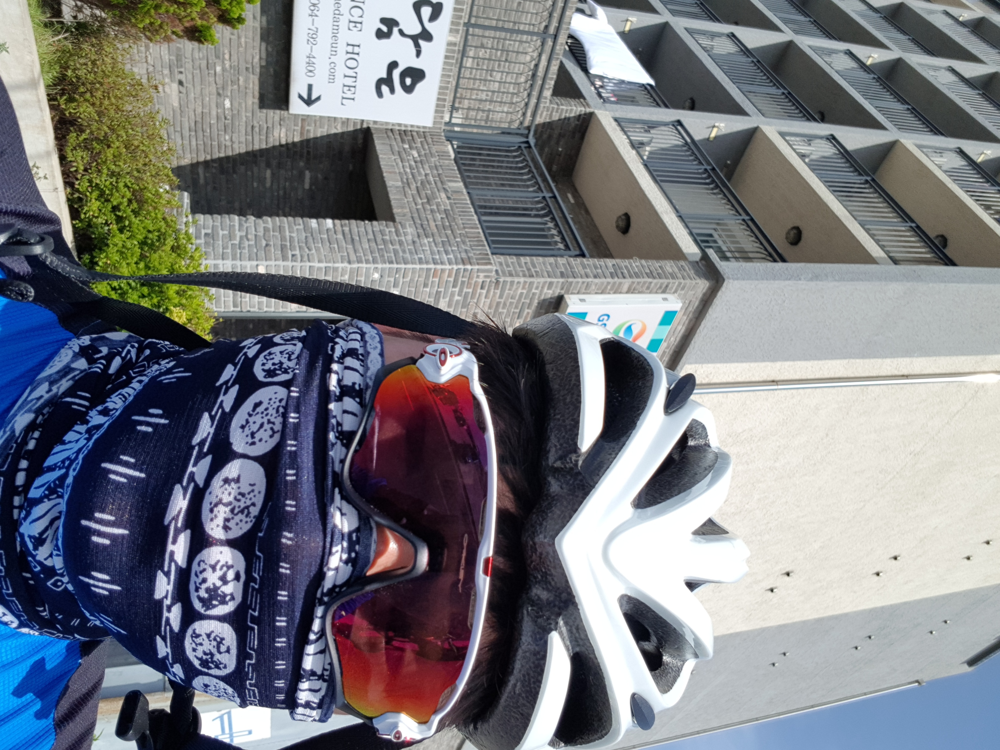
요렇게 셀카도 하나 찍어주고!  

길을 나섭니다.  

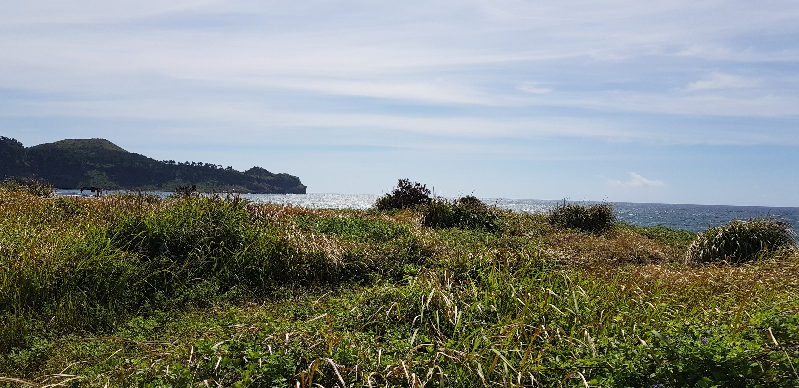
제주도 길은 역시 예쁩니다.  
다만 1일차와 오늘은 오르막 길이 좀 많았기 때문에 상당히 힘들었습니다.  

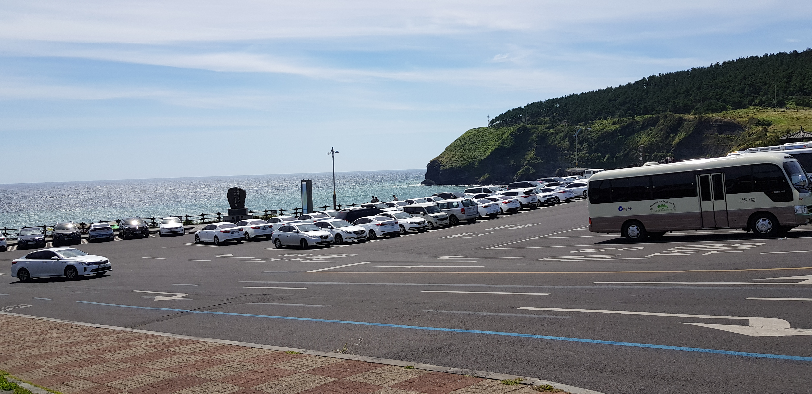
송악산에 도착했습니다. 경치가 너무 아름다워서 찍을 수 밖에 없더라구요!  

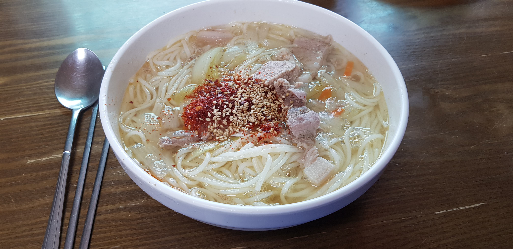
점심은 고기국수였습니다! 평소에는 초계국수와 잔치국수, 비빔국수만 먹어보다가 제주도 명물이고 친구 추천이기도 해서 맛있게 먹었습니다!  
색 다른 맛이 좋더라구요!  

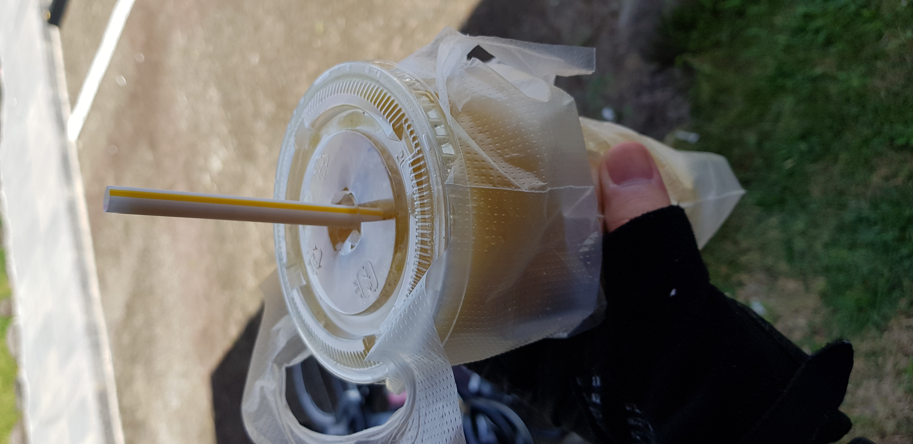

오르막길 막바지에 중문에 도착해서 망고샤비트 한 잔! 이 때만큼은 살 만 했습니다!  

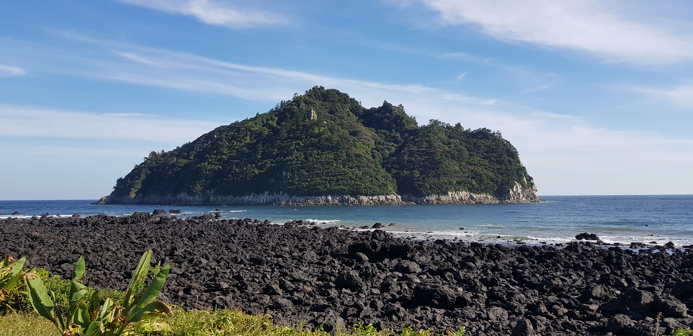
너무 아름다워서 찍었는데, 무인도일까요?

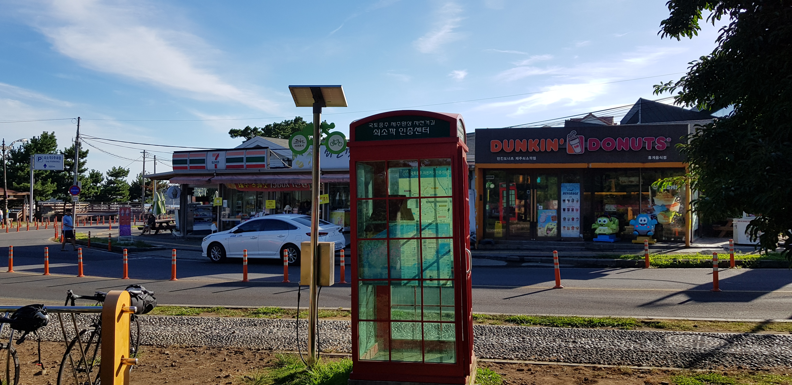
쇠소깍 휴게소에 도착!  
이 때부터는 끝날 때까지 오르막이 거의 나오지 않아서 행복했습니다.  

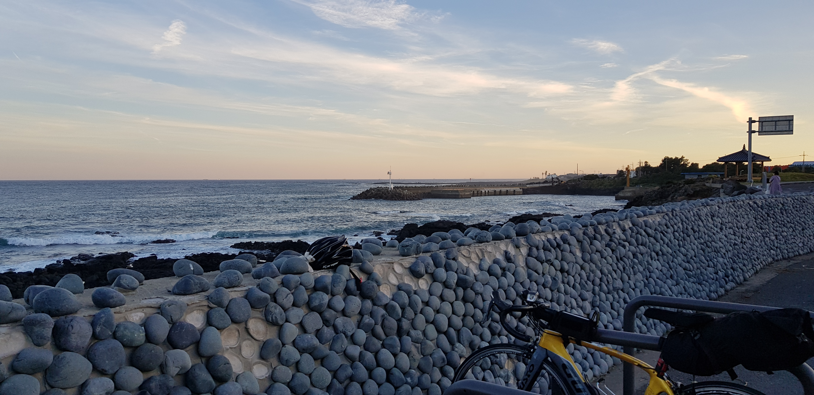
쉬다가 바다가 너무 아름다워서 찍었습니다.

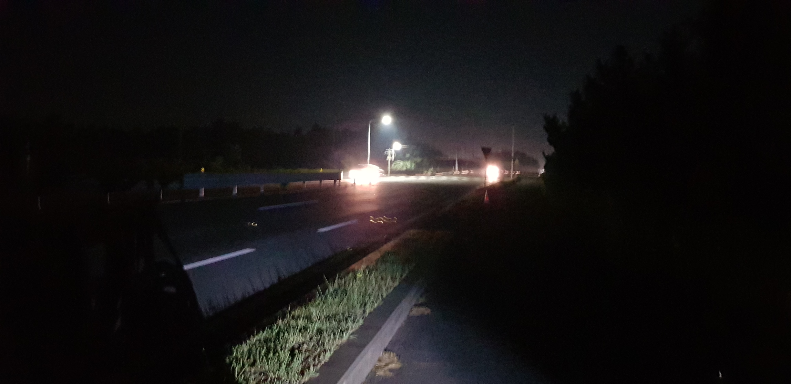
이 날 생각보다 트러블이 많았는데, 대여했던 자전거에 문제가 조금 많더라구요.  
친구가 많이 힘들어했습니다.  
거기에 당일 거리가 생각보다 길었기 때문에 더욱 심했던 것 같네요. 이 때가 오후 9시 경입니다.  

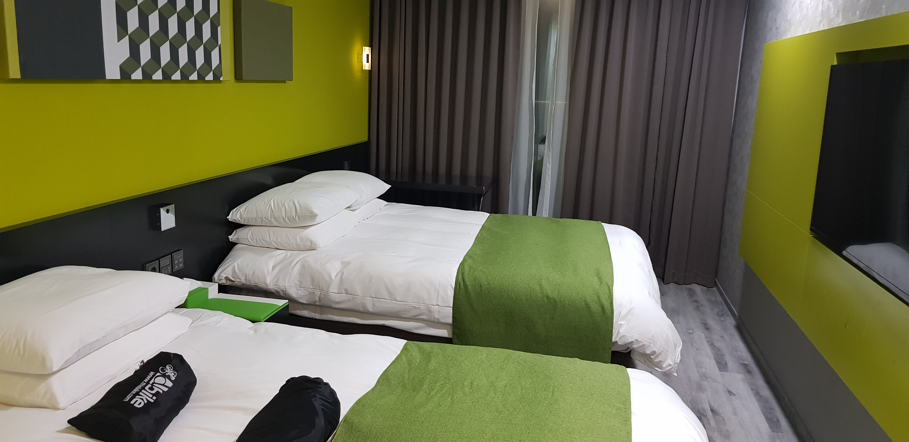
결국 거의 10시즈음 숙소 도착!
이 날은 둘 다 지쳐서 컵라면에 과자, 맥주만 마시고 바로 뻗었습니다.

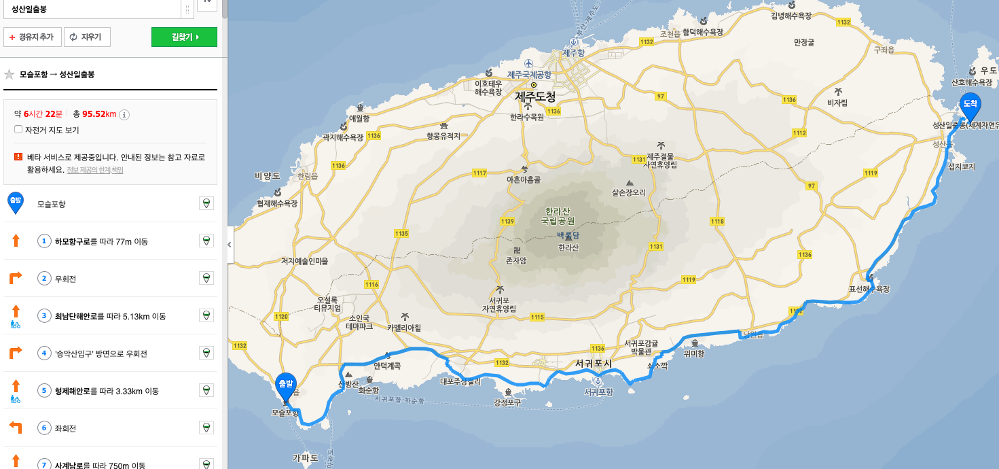
2일차에 달렸던 경로입니다!
