3일차이자 마지막 날입니다!  

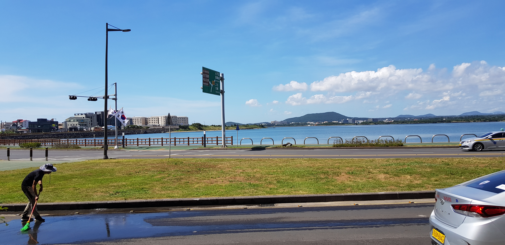

이 날에도 10시즈음 출발한 듯 싶습니다.  

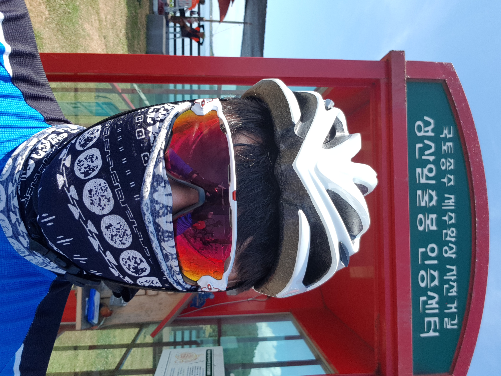

바로 앞에 있는 성산일출봉 인증센터에서 셀카도 찍어주고!  

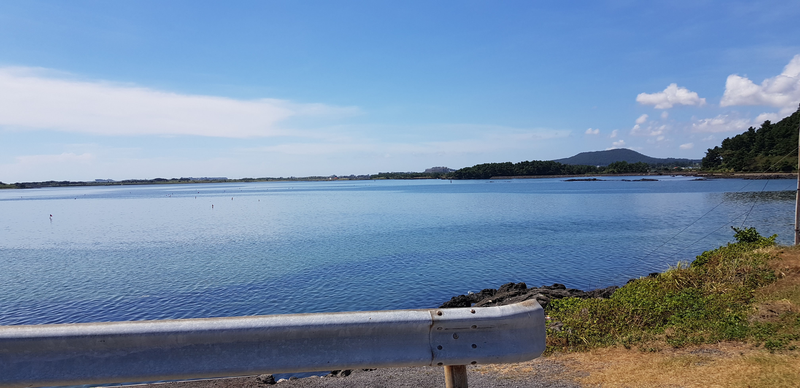

풍경도 찍어줍니다. 정말 예뻤습니다!  

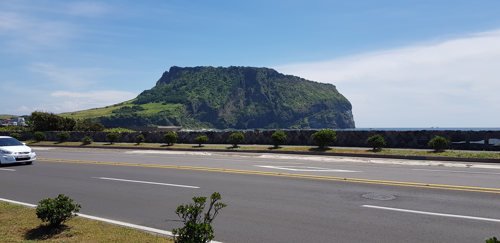

온 김에 성산일출봉도 찍어주고!  

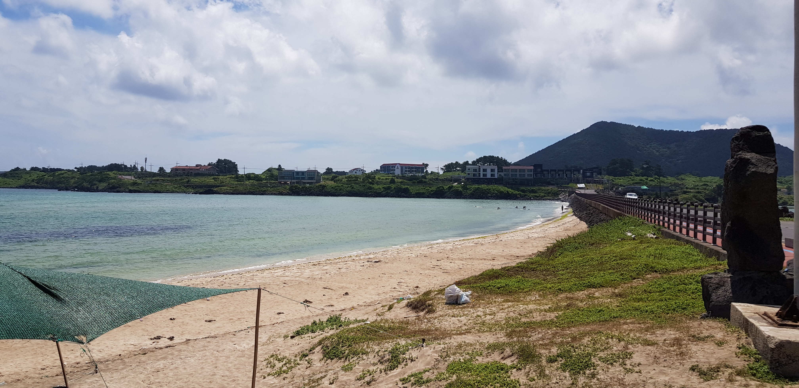
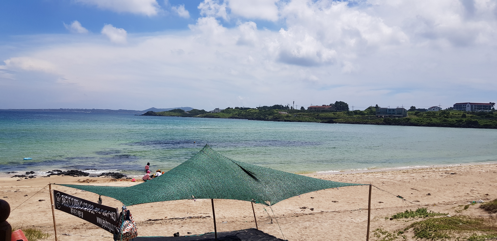

앞에서 여행 오신 가족들이 해수욕을 즐기고 있었지만, 초상권 관계로 살짝 옆에서 찍었습니다.  

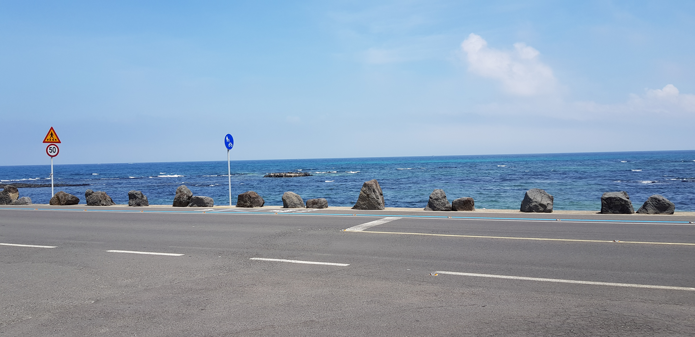

3일차는 거의 이런 해안가 길을 달렸습니다. 저는 태어나서 바다를 본 게 10번이 안 됐었는데, 이번 기회에 아주 뽕(?)을 뽑고 가네요!  

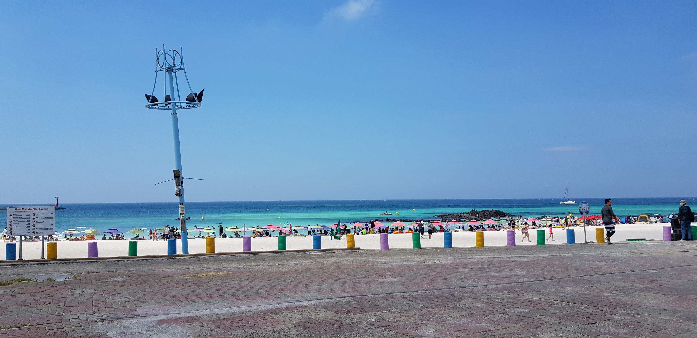
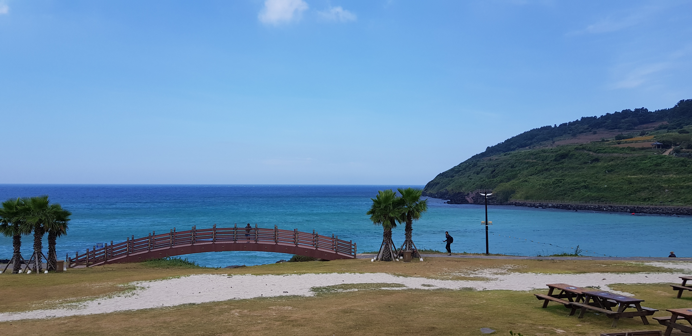

여기는 함덕해수욕장입니다!  

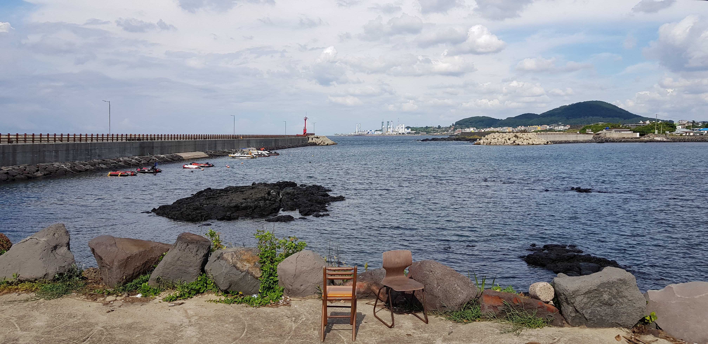

이 여행도 거의 끝나가는 것 같습니다.  
어째 이 뒤는 사진이 많이 없네요?..  

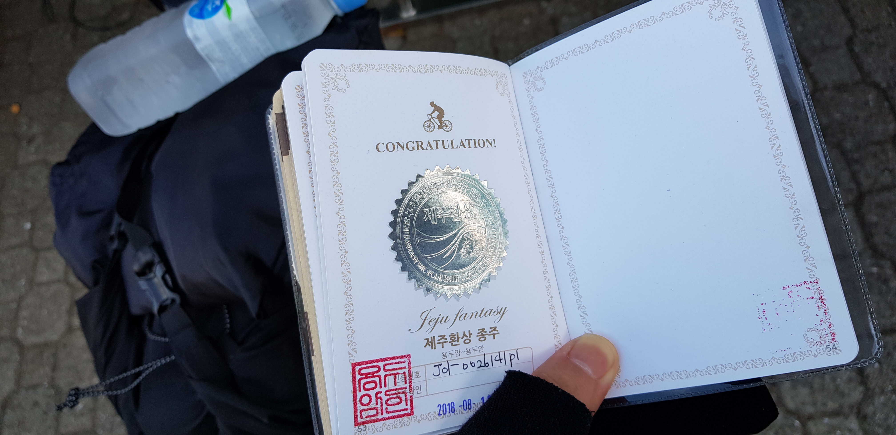

갑자기 완주 스티커!  

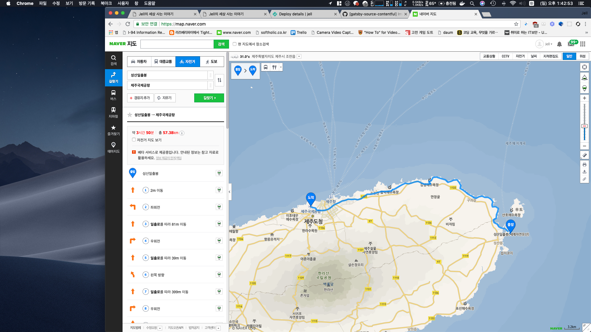

3일차 지도입니다!
