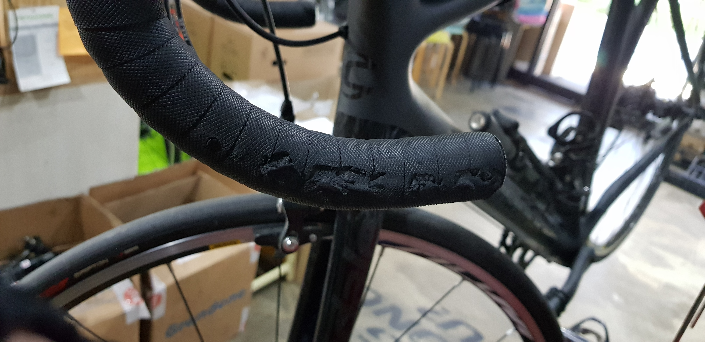
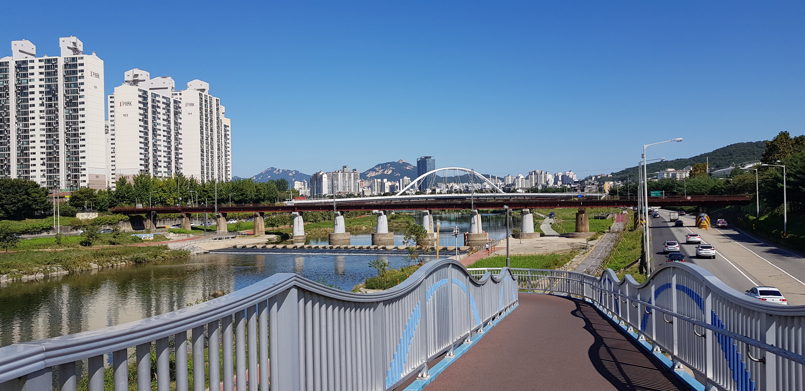
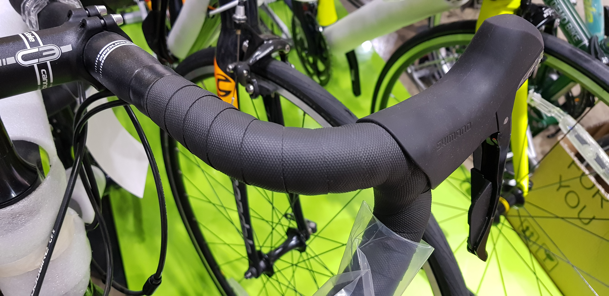
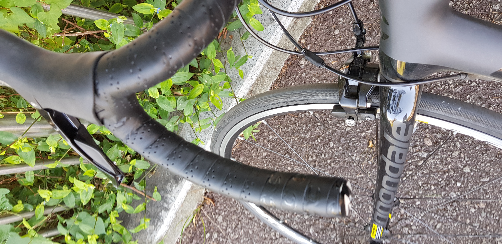

이번주 수요일, 친한 동생과 팔당에 초계국수를 먹으러 가다가 처음으로 낙차를 했습니다.  
인도에 있던 아이가 갑자기 자전거 도로에 나와서 미처 속도를 줄일 거리를 확보를 못해서 낙차하게 되었는데요.  
자전거도, 저도, 친한 동생도 크게 다치진 않아서 다행이라고 생각하고 있습니다.  
문제는.....  

  
그렇습니다. 바테잎이 모두 까졌습니다 ㅜㅜ  
그래서 바테잎을 교체하기 위해 자전거 샵에 들렀습니다!  
  
날씨는 너무 좋았구요!  
원래라면...

살 당시에는 이렇게 되어있었습니다.  
지금 바테잎의 그립이 정말 마음에 들었지만, 혹시나 더 나은 그립의 바테잎이 있을 수도 있고, 기분 전환 겸 바테잎을 바꿔보았습니다.  
다행히 바테잎이 이렇게 까진 걸 감안하면 자전거 자체의 데미지는 없다고 해주시네요!  

그리고 이게 이번에 바꾼 바테잎입니다! 확실히 느낌은 많이 다르네요!