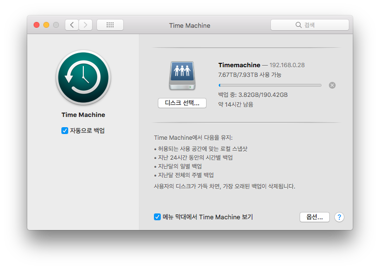

Mac에는 타임머신이라는 기능이 있습니다.  
일종의 백업 툴인데요, Mac 안에 있는 정보를 Git처럼 변동사항 위주로 저장해놨다가 문제가 생겼을 때 꺼낼 수 있는 기능입니다.  
그 전까지는 '아 이런 기능이 있구나~'하고 넘어갔었는데, 이번에 장난감으로 쓰던 노트북을 포맷하면서 기능을 설정해봤습니다.  
백업이 끝나면, 새로운 macOS인 Mojave 베타를 설치해봐야겠네요. :)
