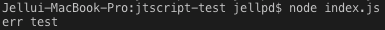
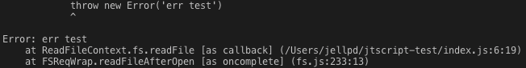

콜백 함수는 아무리 해도 적응이 안됩니다.  
타 언어(C, Java, Swift 등..)에서 당연하다 생각되었던 방법들이 하필 Javascript/Typescript에서만 안되면 곤혹스러운데요.  
그 중 하나를 소개해드리고자 합니다.  
바로 try~catch문입니다.  
다음은 일반적인 try~catch입니다.  

```javascript
const calltry = () => {
    try {
        throw new Error('err text')
    } catch (err) {
        console.log(err.message)
    }
}
```
강제적으로 에러를 발생시켜 catch문에서 받게 하는 방법입니다.  
  

  
당연하게도, 특별히 unhandled exception이 나오지 않습니다.  
문제는 여기에 콜백 함수가 들어갈 때입니다.  

```javascript
const calltry = () => {
    try {
        fs.readFile('nonexist.txt', (err, data) => {
            throw new Error('err text')
        })
    } catch (err) {
        console.log(err.message)
    }
}
```

  
이상하죠? 분명 try~catch로 감쌌는데 말이죠.  
원인은 callback 함수는 익명 함수라는 데에 있습니다.  
콜백으로 감싸지는 순간, 선언된 함수와는 별개로 들어가게 됩니다.  
그래서 아무리 감싸도 catch에 걸리지 않는 것이죠.  
이를 해결하기 위해서는 callback안에 try~catch를 선언하면 됩니다.  

```javascript
const calltry = () => {
    fs.readFile('nonexist.txt', (err, data) => {
        try {
            throw new Error('err text')
        } catch (err) {
            console.log(err.message)
        }
    })
}
```
이렇게 선언하면 위에 나온 대로 제대로 catch문에 들어가는 걸 확인할 수 있습니다.